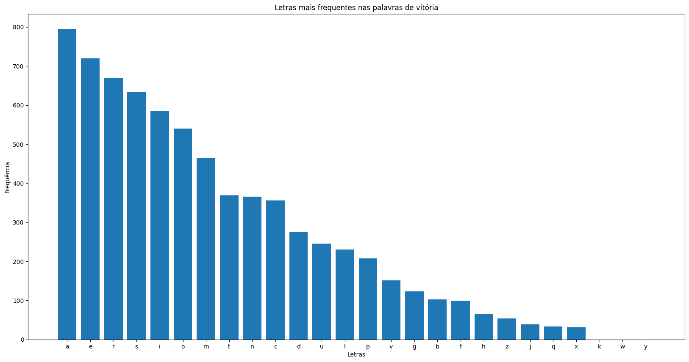

# APS-Forca

## Projetar e avaliar um jogador de forca

### Ideia implementada

A ideia utilizada para criar um jogador autônomo de forca e obter bons resultados, foi a de priorizar os melhores chutes dentre as opções relevantes.

Ele implementa uma abordagem iterativa, onde joga múltiplas rodadas do jogo, coletando estatísticas de vitória e derrota ao longo do caminho.
A estratégia é baseada na redução progressiva de um vocabulário de palavras possíveis até sobrar apenas a reposta, com base nas respostas fornecidas pelo jogo a cada tentativa de adivinhar a palavra.

Quais são os Melhores chutes?

Os melhores chutes são as letras que estão em mais frequência no vocabulário, assim tem mais chances de levarem a acertos e levantarem  novas informações relevantes. **IMPORTANTE!** Letras que estão em mais frequência no vocabulário, são letras que aparecem em mais        palavras, idependente de ser uma vez em dada palavra ou várias vezes.

<-------- Exemplo dos melhores chutes considerando o vocabulário inicial ------->

Quais são as Opções relevantes?

Sempre que for possível a lista de palavra que podem ser a palavra secrete deve ser atualizada. No momento que é determinado o tamanho da palavra, todas as que não tem o mesmo tamanham devem ser descartadas, assim como as possuem letras que não condizem com o feedback dos chutes.

### Conceito de Teoria da Informação utilizado

Entropia: 

A entropia é uma medida de incerteza ou surpresa. No início do jogo, quando temos muitas palavras possíveis, a entropia é alta. À medida que fazemos tentativas de letras e filtramos o vocabulário, a entropia diminui. A estratégia de escolher a "MelhorLetra" tenta maximizar a redução de entropia - a letra que aparece no maior número de palavras provavelmente nos dá a maior informação e, portanto, a maior redução de entropia.

# Resultados

Porcentagem de acertos dentro todos os casos

Acurácia: Entre 95% 

Porque em 5% dos casos o jogador falha?

Como os melhores chutes são selecionados baseando-se na frequência das letras em palavras dentro do conjunto relevante do vocabulário. Com palavras que se distanciem da maioria, o jogador gasta seus melhores chutes e mesmo assim não acerta as letras, pois essas mesmas letras estão entre os piores chutes jogador, e portando por mais que exista filtros no vocabulário ele acaba perdendo suas tentativas antes de acertar.

É possível vizualizar essa diferença na frequência das letras em palavras que levaram a vitória e a derrota.

